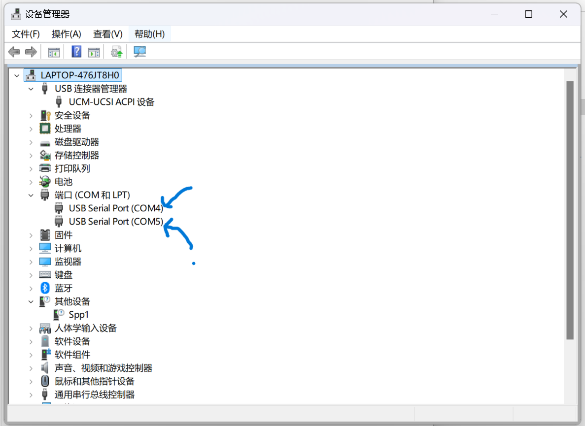
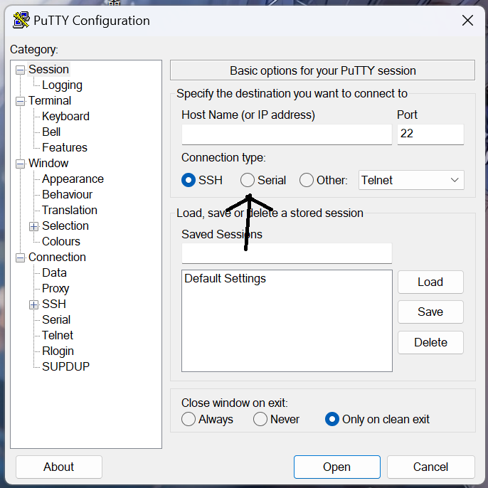
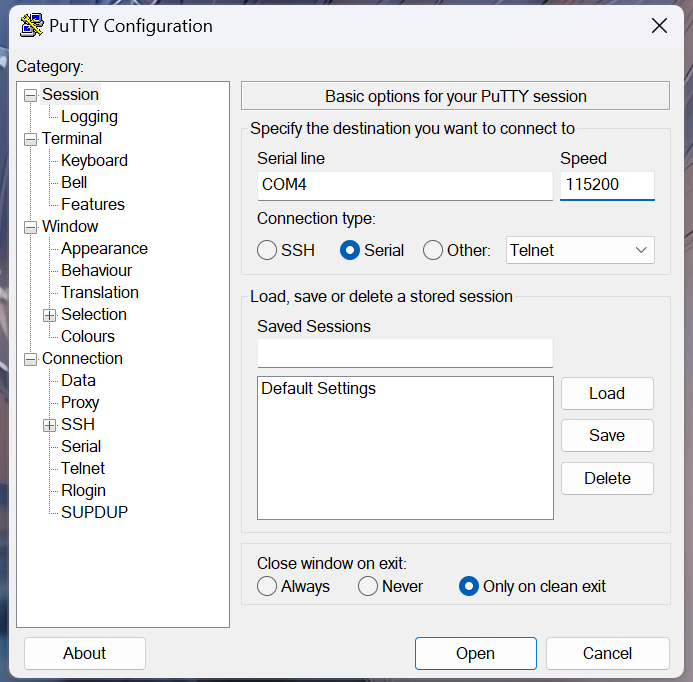

### Ubuntu22.04TLS镜像烧录

[镜像下载地址](https://ubuntu.com/download/amd#kria-kv260-kr260)

[镜像烧录工具下载地址](https://ubuntu.com/download/amd#kria-kv260-kr260)

**镜像烧录后启动kv260板子，通信方式有两种：USB UART连接，HDMI连接。建议使用HDMI连接。**


### USB UART连接

#### 1. kv260安装usb驱动 

FTDI VCP驱动程序[官网下载地址](https://ftdichip.com/drivers/vcp-drivers/)

FTDI VCP驱动程序[官方安装pdf文件地址](https://ftdichip.com/wp-content/uploads/2023/11/AN_396_FTDI_Drivers_Installation_Guide_for_Windows_10_11.pdf)

#### 2. putty下载

putty[下载地址](https://www.365xiazai.com/soft/10169.html)

#### 3. 开始串口通信：

##### 查看设备管理器，找到端口，查看端口号



##### 打开putty，选择端口，输入Speed的值





#### 4. 点击open进入终端界面，输入账号密码：

**用户名：** `ubuntu`

**密码：** `ubuntu`

**进入后需要重置密码**


### HDMI连接

输入初始密码：ubuntu进入图形界面

#### 1. 网络配置

fpga板子一开始是没有网络的，需要连接无线网卡再安装驱动才可以连接wifi。

我们使用的是绿联的网卡，型号是：AC650 11ac 无线双频网卡

[驱动下载地址]( https://pan.baidu.com/s/1yWMzbO41dkP_v8kFr9_qsA?pwd=ijt2 ) 提取码: ijt2 

#### 2. install the xlnx-config snap using

`sudo snap install xlnx-config --classic --channel=2.x`

#### 3. install KRIA Specific PPAs

`sudo xlnx-config.sysinit`

**注意：出现的所有[Y/n]选择Y，并且在提示时按Enter继续**

**注意：安装时要注意屏幕，在询问[Y/n]时，要及时给出回复Y，长时间不回复可能会导致某些部分安装失败**

**注意：再出现如下图所示画面时，通过↑键选择红圈圈出的选择，黄色部分为默认部分，不可以选择，选择错误将导致安装错误**


**注意：其他任意窗口默认设置即可，直接OK**

#### 4. PYNQ安装

**先在浏览器登入github账号**

```
git clone https://github.com/skalade/Kria-PYNQ -b bootcamp 
cd Kria-PYNQ 
sudo bash ./install.sh -b KV260
```

#### 5. 获取 PYNQ Bootcamp 培训材料

```
sudo su - 
cd /home/root/jupyter_notebook 
git clone https://github.com/Xilinx/PYNQ_Bootcamp.git 
cd PYNQ_Bootcamp
```

**注意：培训材料文件过大，拉取过程中网络出现波动会导致拉取失败，建议直接在github上下载.zip文件。**

#### 6. 访问 Jupyter Notebook

`kria:9090`

**登入jupyter notebook后，点击upload导入前面下好的.zip文件，之后新建一个文件，输入以下代码解压.zip文件，之后你就可以去运行里面的案例了**

```python
import zipfile

# 定义解压函数
def unzip_file(zip_path):
    with zipfile.ZipFile(zip_path, 'r') as zip_ref:
        zip_ref.extractall('.')
        print("文件已成功解压至当前目录")

# 示例用法
zip_path = 'path_to_your_zip_file.zip'  # 替换为你的zip文件路径

# 调用解压函数
unzip_file(zip_path)
```
